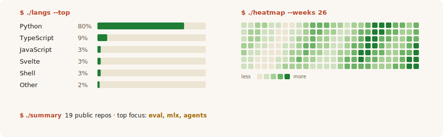

<picture>
  <source media="(prefers-color-scheme: dark)" srcset="hero-dark.svg" />
  
</picture>

**AI Systems Engineer** — evaluation · grounded reasoning · on-device inference. Currently a Research Contributor at Sentient Arena (Cohort 0).

[**↗ portfolio**](https://jwalin-shah.github.io) · [↗ email](mailto:jwalinshah13@gmail.com) · [↗ linkedin](https://linkedin.com/in/jwalin-shah)

---

### Selected work

**[tensor-logic](https://github.com/jwalin-shah/tensor-logic)** — working through Domingos (2025).
A 3-scalar tensor-logic recurrence vs. a 71M-parameter MLP, same task. `mean F1 0.975 vs 0.331 · biggest graph 1,532 nodes (sympy) · zero-shot to real Python imports.` Honestly documented limits — parity remains unlearnable.

**[officeqa-arena](https://github.com/jwalin-shah/officeqa-arena)** — grounded financial QA, Sentient Arena.
`184.5/246 (75.0%) · $1.71 total · 9 architectural generations.` Headline finding: shell `grep` on raw TXT beat an 11GB SQLite + 10-component consensus pipeline. 48% of failures = wrong table/row/column extraction.

**[jarvis-ai-assistant](https://github.com/jwalin-shah/jarvis-ai-assistant)** — privacy-first iMessage assistant on an 8GB M2 Air.
`mean draft 0.42s · p95 1.15s · retrieval Hit@5 0.88 · hallucination gate 96.2% pass.` MLX-native, zero cloud dependencies. Evaluated 37 model configs.

**[openhuman](https://github.com/jwalin-shah/openhuman)** — open-source agentic desktop assistant.
`Rust core · GNU · macOS · Windows · Linux.` Local-first KB (Neocortex), background self-learning loops (Subconscious), screen intelligence, inline autocomplete + voice, all on device.

---

<picture>
  <source media="(prefers-color-scheme: dark)" srcset="stats-dark.svg" />
  
</picture>

---

### Background

| | | |
|---|---|---|
| **Sentient Arena** | Research Contributor (Cohort 0) | grounded financial reasoning · eval infra · failure-mode analysis |
| **Skild AI** | Data Operations Lead | robotics data systems · 5 platforms · 25+ operators · task success **+40%**, overhead **−50%** |

### Focus

`grounded LLM reasoning` · `evaluation harnesses` · `deterministic computation` · `tool-augmented agents` · `hallucination measurement` · `on-device inference (MLX)` · `privacy-first architectures`

### Reach me

best for research collabs, eval & reliability work, on-device AI.
✉️ [jwalinshah13@gmail.com](mailto:jwalinshah13@gmail.com) · 💼 [linkedin](https://linkedin.com/in/jwalin-shah) · 🌐 [portfolio](https://jwalin-shah.github.io)
