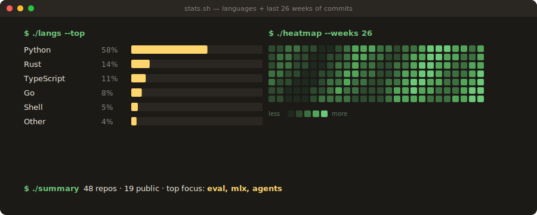

<div align="center">


</div>

```
> whoami
```

**Jwalin Shah** — AI Systems Engineer building systems that **measure, diagnose, and improve LLM behavior**. Currently spending cycles on grounded reasoning, deterministic computation, and on-device inference.

📍 SF · ✉️ jwalinshah13@gmail.com · 🌐 [**jwalin-shah.github.io**](https://jwalin-shah.github.io) (interactive portfolio)

---

```
> ls --highlights
```

### `officeqa-arena/` — grounded financial reasoning
> Multi-agent LLM system. Top-tier on a 246-task Sentient Arena benchmark.

```
score      184.5 / 246    pass-rate    75.0%
cost       $1.71          iterations   9 generations
```

**Findings —** simplicity wins (shell `grep` beat an 11GB SQLite + 10-component pipeline). 48% of failures = wrong table/row/column extraction. "Review your intern's work" framing beat "verify your answer" by **+13 points**. Prompt-engineering ceiling sits around 70%.

→ [`jwalin-shah/officeqa-arena`](https://github.com/jwalin-shah/officeqa-arena)

---

### `jarvis-ai-assistant/` — privacy-first iMessage assistant
> Local-first AI on an 8GB M2 Air. MLX inference, zero cloud dependencies.

```
mean draft     0.42s        retrieval Hit@5    0.88
p95 draft      1.15s        hallucination gate 96.2% pass
```

**Findings —** dual-path architecture (fast-path for simple queries, background pipeline for complex grounded reasoning). Evaluated **37 model configs** across latency / Hit@5 / hallucination. Template-first + generation fallback cuts cost and risk; pure embedding classification was tried and rejected.

→ [`jwalin-shah/jarvis-ai-assistant`](https://github.com/jwalin-shah/jarvis-ai-assistant)

---

### `tensor-logic/` — working through Domingos (2025)
> A **3-scalar** tensor-logic recurrence beats a **71M-parameter** MLP at transitive closure — by 4+ orders of magnitude.

```
TL params         3 scalars      MLP params       71M (fails at n=128)
mean F1           0.975          biggest graph    1,532 nodes (sympy)
```

**Findings —** a logical rule and an einsum are the same operation; activation function picks the semantic. TL is enormously parameter-efficient when a closed-form operator exists — and it cannot magic one into existence when one doesn't (parity remains unlearnable, honestly documented).

→ [`jwalin-shah/tensor-logic`](https://github.com/jwalin-shah/tensor-logic)

---

### `openhuman/` — your personal AI super intelligence
> Open-source agentic desktop assistant. Local-first KB, deep OS integration.

```
core           Rust            license     GNU
platforms      macOS · Win · Linux         stage       early beta
```

**Highlights —** Neocortex (local KB compounding context across tools), the Subconscious (background self-learning loops), Screen Intelligence (agent reads what's on your screen), inline autocomplete + voice (STT/TTS) anywhere on desktop.

→ [`jwalin-shah/openhuman`](https://github.com/jwalin-shah/openhuman)

---

```
> ./stats.sh
```

<div align="center">



</div>

---

```
> cat focus.txt
```

`grounded LLM reasoning` · `evaluation harnesses & telemetry` · `deterministic computation` · `tool-augmented agents` · `hallucination measurement` · `on-device inference (MLX)` · `privacy-first architectures` · `robotics reliability`

---

```
> cat background.txt
```

| where | what | the gist |
|---|---|---|
| **Sentient Arena** | Research Contributor (Cohort 0) | Grounded financial reasoning · eval infra · failure-mode analysis |
| **Skild AI** | Data Operations Lead | Robotics data systems at scale · 5 platforms · 25+ operators · task success **+40%**, overhead **−50%** |

---

```
> ./contact.sh
```

| | |
|---|---|
| ✉️  email | [jwalinshah13@gmail.com](mailto:jwalinshah13@gmail.com) |
| 💼 linkedin | [linkedin.com/in/jwalin-shah](https://linkedin.com/in/jwalin-shah) |
| 🌐 portfolio | [jwalin-shah.github.io](https://jwalin-shah.github.io) |

> *best for: research collabs · eval & reliability work · on-device AI*

```
$ █
```
