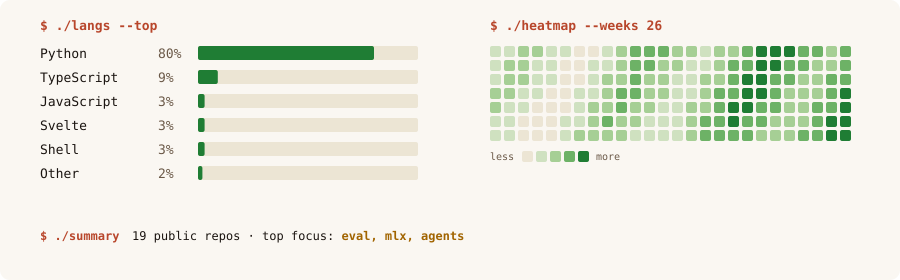

<picture>
  <source media="(prefers-color-scheme: dark)" srcset="hero-dark.svg" />
  
</picture>

**AI Systems Engineer** — agent infrastructure · evaluation · local-first AI.

Core contributor to [OpenHuman](https://github.com/tinyhumansai/openhuman) (35k+ ★). Previously Data Operations Lead at Skild AI ($1B Series C).

[**↗ portfolio**](https://jwalin-shah.github.io) · [↗ email](mailto:jwalinshah13@gmail.com) · [↗ linkedin](https://linkedin.com/in/jwalin-shah) · [↗ resume](https://github.com/jwalin-shah/jwalin-shah/raw/main/Jwalin_Shah_Resume_General.pdf)

---

### Selected work

**[OpenHuman](https://github.com/tinyhumansai/openhuman)** — core contributor *(tinyhumansai)*.
Own `life_capture` / `curated_memory` in the Rust core: on-device personal index over iMessage, Gmail, Calendar, Contacts. Hybrid retrieval (FTS + sqlite-vec). 80+ upstream commits spanning memory, chat reliability, and security-policy hardening.

**[voice-engine-swift](https://github.com/jwalin-shah/voice-engine-swift)** — local dictation, measured.
`26 ASR models · 560 clips · moonshine-tiny 0.2177 WER / 0.05 RTF` — near-equal accuracy to a 2.5B model at 14× lower RTF. Real-time on device, no network, no clipboard.

**[tensor-logic](https://github.com/jwalin-shah/tensor-logic)** — Domingos (2025), empirically.
`3 scalars vs 71M MLP · F1≈1.000 zero-shot to n=1024 · OSS graphs to 1,532 nodes.` Limits documented (parity / XOR) — not hidden.

**[officeqa-arena](https://github.com/jwalin-shah/officeqa-arena)** — Sentient Arena Cohort 0.
`184.5/246 (75%) · $1.71 · 3,600+ evals · 9 architecture generations.` Retrieval and tool selection — not model “reasoning” — drove most failures.

**Bridge** *(private)* — reliable coding-agent execution.
Default-deny OS sandbox · isolated worktrees · fresh-checkout verification. The agent cannot certify its own success. Happy to walk through architecture.

---

<picture>
  <source media="(prefers-color-scheme: dark)" srcset="stats-dark.svg" />
  
</picture>

---

### Background

| | | |
|---|---|---|
| **OpenHuman** | Core Contributor | on-device personal memory · hybrid retrieval · 80+ commits |
| **Skild AI** | Data Operations Lead | 5 robotic platforms · 30+ operators · task success **+40%**, overhead **−50%** · 25+ Series C demos |
| **Break the Web / LiveLM** | AI Systems Engineer | real-time grounding · MCP tool-use eval · hit/partial/stale/miss abstention |

### Focus

`agent sandboxing & verification` · `evaluation harnesses` · `on-device inference (MLX / CoreML)` · `hybrid retrieval` · `MCP / tool-use reliability` · `failure-mode taxonomies`

### Reach me

roles in agent infrastructure, eval & reliability, or local-first AI.
✉️ [jwalinshah13@gmail.com](mailto:jwalinshah13@gmail.com) · 💼 [linkedin](https://linkedin.com/in/jwalin-shah) · 🌐 [portfolio](https://jwalin-shah.github.io)
